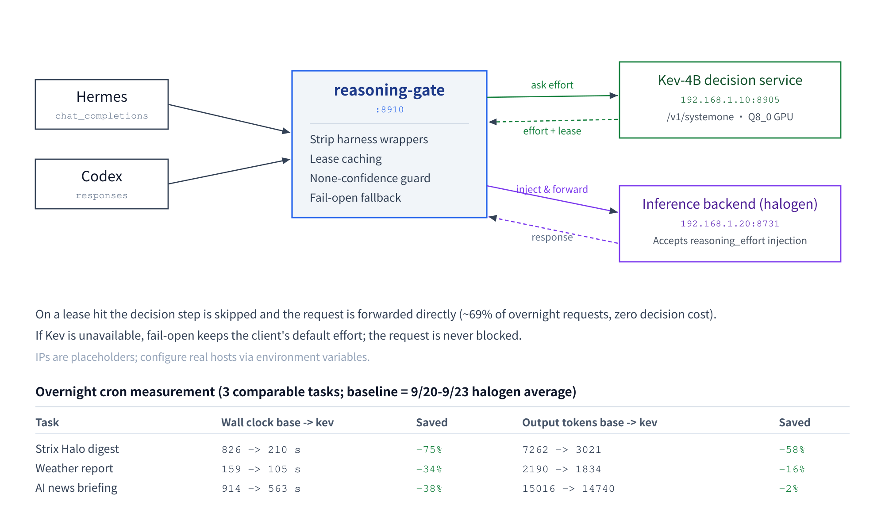

# reasoning-gate

An OpenAI-compatible **reasoning-effort decision layer**. It sits between an agent
(Hermes / Codex) and an inference backend (halogen / any OpenAI-compatible server
that accepts `reasoning_effort`), and uses a small local model (Kev-4B) to decide,
per request, how much thinking budget the next step actually needs. The decision is
injected into the backend request before forwarding. Simple tasks think less; hard
tasks think more — saving compute without sacrificing quality.



## What problem it solves

Mainstream agent harnesses (including hermes-agent) **do not send `reasoning_effort`**
to custom OpenAI-compatible endpoints — thinking is either always on or always off,
with no per-task adjustment. reasoning-gate adds that layer: every request first asks
Kev-4B "what reasoning depth does the next step need", then injects the matching
effort into the backend call.

```
client (Hermes chat_completions / Codex responses)
        |
        v
   reasoning-gate :8910  -->  Kev-4B decision service (/v1/systemone)
        |                            (dohnuts.cpp HIP, Q8_0, GPU)
        v
   backend (halogen :8731)  <-- reasoning_effort injected, then forwarded
```

## Core features

- **Dual protocol**: handles both `/v1/chat/completions` (Hermes) and
  `/v1/responses` (Codex). Codex uses `reasoning.effort`; both shapes are read on
  input and both are written on output.
- **Lease caching**: Kev answers "effort + how many generations it stays valid" in
  one pass. The cache key is the hash of the latest user message, so growing tool
  output does not bust the cache. In overnight runs ~69% of requests hit the cache
  with zero decision cost.
- **Fail-open**: if Kev is down / times out / returns low confidence, the client's
  default effort is kept — the request is never blocked.
- **Harness-wrapper stripping**: before deciding, boilerplate text (cron / skill /
  memory-context wrappers) is stripped so Kev judges the real task, not the
  boilerplate. Without this, the semantic signal is diluted and confidence drops
  (measured: 0.27 → 0.66 on cron tasks after adding stripping).
- **None-confidence guard**: a wrong `none` (zero thinking) is the most damaging
  misjudgement. It requires a higher confidence threshold (`KEV_NONE_MIN_CONF`),
  otherwise it is bumped to `minimal`.
- **Full JSONL audit**: every request is logged (decision / lease_hit / none_bumped
  / state_preview / applied) for post-hoc analysis of effort distribution and
  compute savings.

## Measured results (overnight cron)

Four scheduled agent jobs were switched from the default halogen backend to
reasoning-gate (`kev-auto`). Baseline = the 9/20–9/23 halogen average per task.
Three tasks are directly comparable; the fourth (agent journal) had a model switch
inside its baseline window and is excluded.

| Task | Wall clock (base → kev) | Saved | Output tokens (base → kev) | Saved |
|---|---|---|---|---|
| Strix Halo digest | 826 s → 210 s | **−75%** | 7262 → 3021 | **−58%** |
| Weather report | 159 s → 105 s | **−34%** | 2190 → 1834 | **−16%** |
| AI news briefing | 914 s → 563 s | **−38%** | 15016 → 14740 | **−2%** |
| **Total (3 tasks)** | **1899 s → 878 s** | **−54%** | **24468 → 19595** | **−20%** |

Across the overnight window (00:14 → 08:00): 65 proxied requests — 13 real
decisions, 45 lease hits (69% zero-decision), 7 fail-opens. Decision latency:
median 2.8 s, fastest 0.56 s, 9.3 s worst-case under GPU contention.

Wall-clock savings come from lower effort levels producing shorter reasoning
blocks; output-token savings are smaller because the final answer length is
task-bound. The biggest win is on tasks Kev confidently classifies as simple
(Strix Halo: −75% wall clock). All jobs completed and delivered normally; the
fail-open path was exercised (HTTP 413 on an oversized state, since fixed by
capping the decision payload) without any job failing.

## Deployment

### 1. Kev-4B decision service (backend)

You need a Kev-4B service exposing `/v1/systemone`. This project was tested with a
self-compiled HIP build of
[dohnuts.cpp](https://github.com/DreamBlooms/dohnuts.cpp) (AMD gfx120x, Q8_0 full
GPU offload, ~4.4 GB VRAM, median decision latency ~2.8 s). Any service returning
the same System-One schema works.

### 2. reasoning-gate

```bash
cp .env.example .env   # adjust to your topology
KEV_URL=http://<kev-host>:8905/v1/systemone \
BACKEND_CHAT=http://<backend>:8731/v1/chat/completions \
BACKEND_RESP=http://<backend>:8731/v1/responses \
python3 kev_proxy.py
```

### 3. systemd (Linux)

```bash
# edit Environment= paths/addresses in kev-proxy.service
cp kev-proxy.service ~/.config/systemd/user/
systemctl --user daemon-reload
systemctl --user enable --now kev-proxy
```

### 4. Register as a selectable model

**Hermes** (top-level `model_aliases:` in config.yaml — a direct alias is required
for `-m kev-auto` to route correctly; a plain `custom_providers` entry is silently
ignored by the CLI):
```yaml
model_aliases:
  kev-auto:
    model: kev-auto
    provider: kev-proxy
    base_url: http://127.0.0.1:8910/v1
    api_key: kev-local
```

**Codex** (`~/.codex/config.toml` + `model_catalog.json`):
```toml
[model_providers.kev]
name = "kev (auto effort via Kev-4B)"
base_url = "http://127.0.0.1:8910/v1"
wire_api = "responses"
requires_openai_auth = false
```

**Pin a cron job**: `hermes cron edit <id> --model kev-auto --provider kev-proxy`

## Configuration (environment variables)

| Variable | Default | Description |
|---|---|---|
| `KEV_URL` | `http://192.168.1.10:8905/v1/systemone` | Kev-4B decision service |
| `BACKEND_CHAT` | `http://192.168.1.20:8731/v1/chat/completions` | Backend chat endpoint |
| `BACKEND_RESP` | `http://192.168.1.20:8731/v1/responses` | Backend responses endpoint |
| `BACKEND_MODEL` | `halogen-qwen3.8-flash-next` | Real model name forwarded to backend |
| `KEV_DEFAULT_EFFORT` | `medium` | Fallback when no client effort is given |
| `KEV_LOG` | `~/.hermes/kev-proxy/decisions.jsonl` | Decision audit log path |
| `KEV_LEASE_CAP` | `5` | Max generations a lease stays valid |
| `KEV_NONE_MIN_CONF` | `0.55` | Min confidence required to judge `none` |

Effort mapping follows the halogen contract: `minimal/low/medium/high/xhigh` +
`none` (the chat template folds to three tiers: minimal,low→low; high,xhigh→xhigh).

## Known limitations

- Kev-4B is a **text-semantic** decision model and is blind to numeric state;
  numeric threshold decisions should be plain code, not a decision model.
- The decision model itself adds latency (GPU contention queues); lease caching is
  the main mitigation.
- Confidence is generally low (0.3–0.68 is common); fail-open + the none-guard are
  safety nets, not hard guarantees.
- Savings concentrate on tasks with a clear simple/complex split. On tasks that are
  genuinely complex end to end (AI news briefing: −2% output tokens), the gate
  mostly avoids *extra* thinking rather than removing needed thinking.

## License

MIT

---

中文文档见 [README_zh.md](README_zh.md)。
